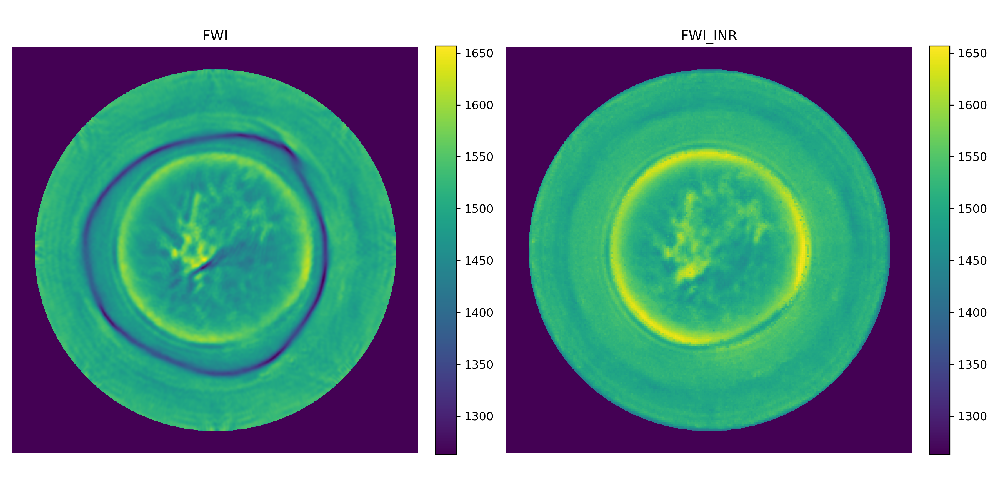

# INR-based Full Waveform Inversion for Acoustic Reconstruction

##  Overview

This project explores the application of Implicit Neural Representation (INR) in Full Waveform Inversion (FWI) for acoustic image reconstruction.

A neural-network-based continuous representation is used to reconstruct sound velocity distributions from simulated wavefield data, aiming to improve reconstruction quality and structural consistency in medical acoustic imaging.



---

##  Key Features

- Implemented INR-based continuous acoustic field reconstruction
- Applied SIREN-style neural representation for velocity modeling
- Explored different network depths and hidden dimensions
- Investigated the impact of transmitter/receiver configurations
- Evaluated reconstruction quality using SSIM, PSNR, and RMSE

---

##  Tech Stack

- Python
- PyTorch
- NumPy
- Matplotlib
- Deepwave

---

##  Project Structure

```text
models/        Neural network architectures
notebooks/     Experiment notebooks
scripts/       Training and evaluation scripts
results/       Reconstruction results and visualizations
```

---

##  Running the Project

```bash
conda env create -f env.yml
python INR_FWI_300k.py
```

---

##  Experimental Results

The experiments compare different:

- Network depths
- Hidden layer dimensions
- Transmitter/receiver configurations

The best-performing configuration achieved:

| Metric | Value |
|---|---|
| SSIM | 0.946 |
| PSNR | 35.70 dB |
| RMSE | 3.45 |

---

##  Research Topics

- Full Waveform Inversion (FWI)
- Implicit Neural Representation (INR)
- Neural Fields
- Computational Imaging
- Deep Learning Reconstruction

---

##  Contact

GitHub: selene7V7
