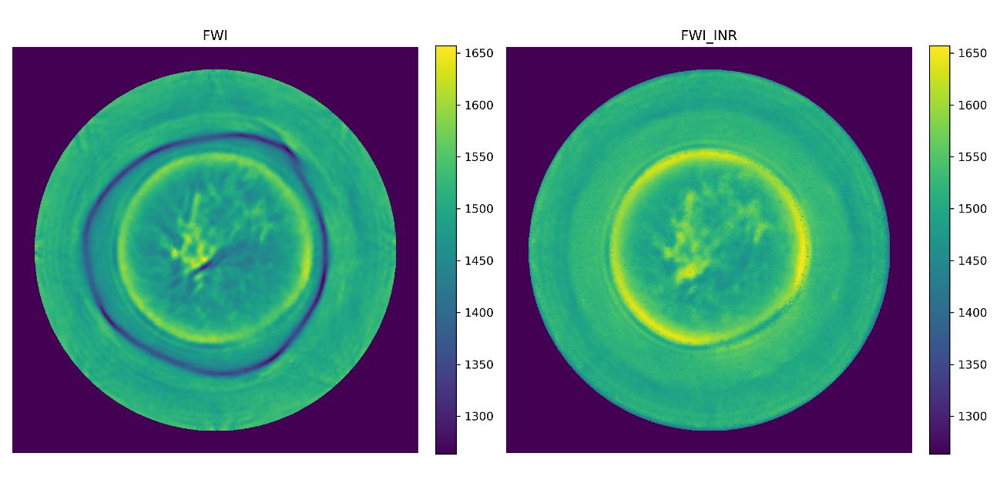

# Experimental Study of INR-based Full Waveform Inversion

##  Overview

This repository contains experimental studies on implicit neural representation (INR) methods for full waveform inversion (FWI) reconstruction in acoustic imaging tasks.

The project focuses on analyzing how different neural network configurations and acquisition settings affect reconstruction quality.



---

##  Main Experiments

- Comparison of different network depths
- Comparison of hidden layer dimensions
- Analysis of transmitter and receiver configurations
- Reconstruction quality evaluation using:
  - SSIM
  - PSNR
  - RMSE

---

##  Tools & Frameworks

- Python
- PyTorch
- Deepwave
- NumPy
- Matplotlib

---

##  Project Structure

```text
models/        Neural network architectures
notebooks/     Experiment notebooks
scripts/       Training and evaluation scripts
results/       Reconstruction results and visualizations
```

---

##  Experimental Results

The experiments show that increasing network depth and hidden dimensions can improve reconstruction quality up to a certain point, while excessively large architectures may lead to instability and overfitting.

The best-performing configuration achieved:

| Metric | Value |
|---|---|
| SSIM | 0.946 |
| PSNR | 35.70 dB |
| RMSE | 3.45 |

---

##  Research Topics

- Full Waveform Inversion (FWI)
- Implicit Neural Representation (INR)
- Medical Acoustic Imaging
- Deep Learning Reconstruction

---

##  Running the Project

```bash
conda env create -f env.yml
python train_300k.py
```

